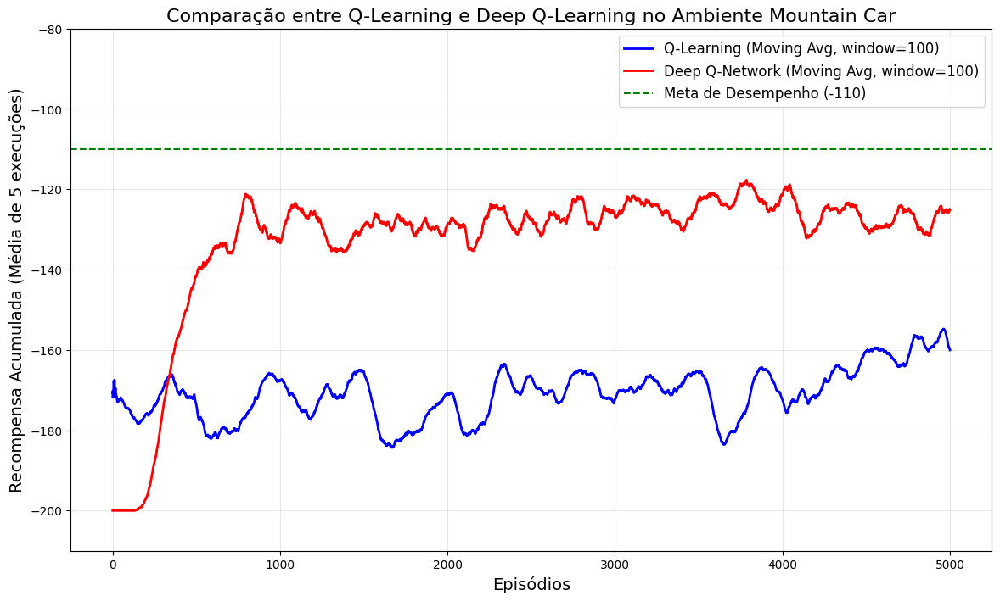
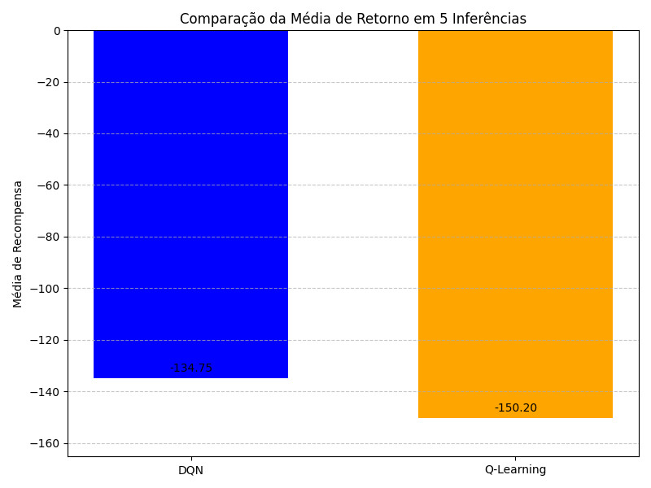

## Armazene os pesos da Q-table.

Estão salvos no path:

logs/q_table_logs/

## Armazene os pesos da rede neural.

Estão salvos no path:

dqn-nn/

## Q1: Compare os resultados obtidos com o Q-Learning e o Deep Q-Learning usando um plot. Tente deixar claro no plot qual a meta de recompensa acumulada para o ambiente MountainCar

A meta de recompensa acumulado para o ambiente MountainCar é -110. Com 5000 episódios e os meu parâmetros pessoais:

- DQN: Convergiu mais rapidamente. Com aproximandamente 1000 episódios já começou a apresentar rewards acumulados entre -140 e -120, com a maioria dos episódios seguintes se mantendo nesse intervalo.

Hiperparâmetros DQN:

    - alpha = 0.01  
    - self.memory = deque(maxlen=10000 )
    - self.gamma = 0.99
    - self.epsilon = 1.0
    - self.epsilon_min = 0.01
    - self.epsilon_dec = 0.995
    - episodes = 5000 
    - batch_size = 64

- Q Learning: Apresentou resultados inicias melhores, mas analisando o gráfico 5000 episódios não foram suficientes para apresentar rewards acima de -140.

Hiperparâmetros Q Learning

    - alpha = 0.1        
    - gamma = 0.99       
    - epsilon = 1.0      
    - epsilon_min = 0.01 
    - epsilon_dec = 0.995 
    - episodes = 10000   

## Q2: Crie outro gráfico que mostra o desempenho de ambos os agentes durante o processo de inferência, ou seja, quando o agente está atuando sem treinamento.

Comparando a média do desempenho do agente durante 20 inferências no ambiente, é possível ver que o DQN teve um desempenho melhor, o que condiz com o gráfico observado sobre a curva de aprendizado.

Com o DQN apresentando na média 15.45 a mais de reward em cada teste.